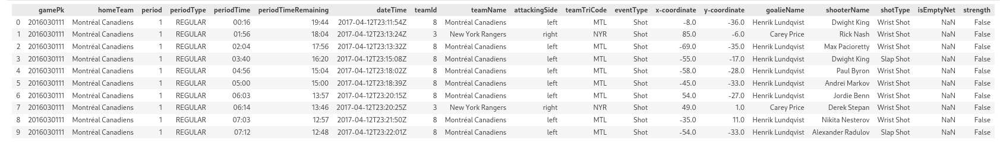

### Tidy Data
### This is an overview of the final data frame

### dataFrame.head(10): 

### Actual strength of players

One possible way to find the actual strength of the players in each event of a game is to start with 5 on 5 and then adjust the number of players according to the penalties that occur. For example, if a penalty leads to an ejection of a player, the number of players for that team will decrease by one for the duration of the penalty. If an event happens during that time, the actual strength of the players will be the number of players for each team after accounting for the penalties. Similarly, if another penalty occurs while a previous penalty is still in effect, the number of players will decrease accordingly.

### Additional features

Attacking side: We can find the home team from the following sequence of dictionaries: linescore -> teams -> home -> team -> name  We also have the period number for each event. Moreover, we can find all the periods in liveData -> linescore -> periods. Now, to find the attacking side for a specific event, we have to find the related period and check the rink side for the home team and the away team. Since we already know whether the home team or the away team was responsible for the event, we can find the attacking side based on the rink side.

Shot distance: We can find the distance of a shot based on the coordinates of the shot and the coordinates of the net. The coordinates of the net depend on the attacking side, which we have it already.

Number of players: To find the actual strength of the players in each event of a game, we have to keep track of the number of players for each team. As we explained in the "Actual strength of players" section, we can start with 5 on 5 and then adjust the number of players according to the penalties that occur. If a penalty leads to an ejection of a player, we decrease the number of players for that team by one for the duration of the penalty. When an event happens, we can compare the time of the event and the time of the last penalty and see if the number of players should be changed accordingly.