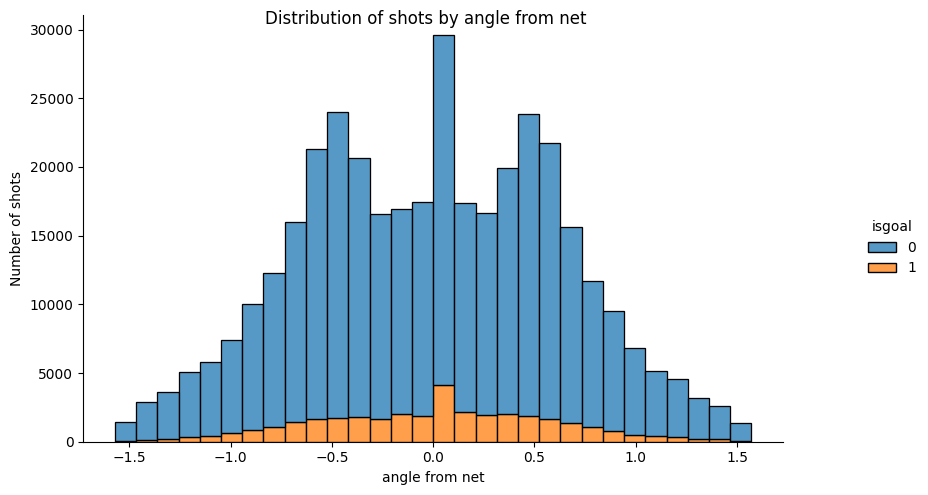
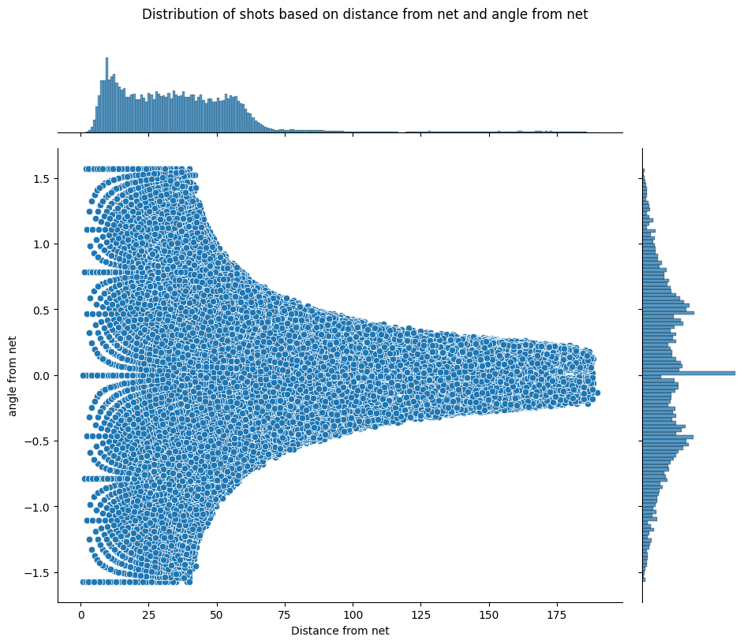
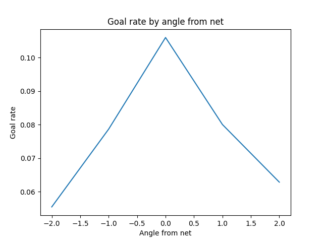
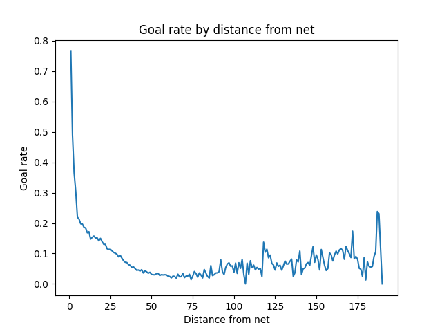
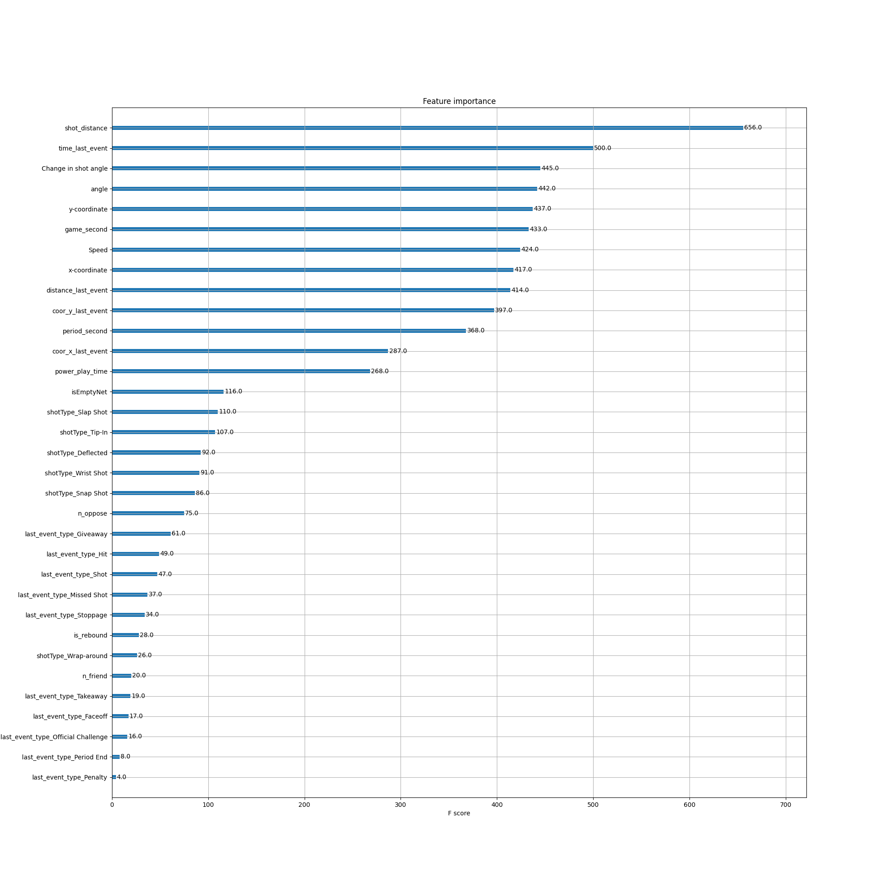

## feature engineering1 

This figure shows how the shot counts vary by distance from the net. As expected, the number of shots and goals decreases as the distance increases, since players tend to shoot closer to the net and scoring from far away is harder. In fact, there are no goals beyond 75 feet. Interestingly, the bin closest to the net does not have the highest number of shots or goals, which may be because it is more difficult to shoot past the goalie at a short range.


This figure shows how the shot counts and goals vary by the angle from the net. We can see that the probability of scoring a goal is higher when the angle is closer to zero, which means that the shooter is facing the net directly. However, the majority of the shots are taken from angles between -0.5 and 0.5 radians, which means that the shooters are slightly off-center. The goals do not follow this trend, and the highest number of goals is achieved at around 0 radian, which means that the shooters are more accurate when they are aligned with the net.



This figure shows how the angle from the net changes with the distance from the net for the shots and goals. We can see that the range of angles decreases as the distance increases, which means that the players shoot with smaller angles when they are farther from the net. This may be because shooting with larger angles from far away is less likely to score or hit the target. Moreover, the figure is symmetric, which means that the sign of the angle does not matter, and the players shoot equally from the left and right sides of the rink. However, the distribution of angles is different for the shots and goals near the net. The shots have a wider range of angles, and some of them are very large, which means that the players shoot from sharp angles close to the net. 



This figure shows how the probability of scoring a goal varies by the angle from the net. We can see that the probability is symmetric with respect to the sign of the angle, which means that it does not matter whether the shot is taken from the left or right side of the rink. However, the probability is higher when the angle is closer to zero, which means that shooting near the center of the rink or aligning with the net increases the chance of scoring a goal. The highest probability is achieved at around 0 radian, which corresponds to facing the net directly.



This figure shows how the probability of scoring a goal changes with the distance from the net. We can see that the probability drops sharply at first, and then decreases gradually as the distance increases. This makes sense because it is harder to score from far away. However, the probability is not zero beyond a certain distance, and it fluctuates slightly. This may be because there are some outliers or exceptional shots that score from a long distance.



This figure shows the effect of distance from the net and net emptiness on the probability of scoring a goal. As explained in the document, the probability of scoring a goal with a non-empty net decreases as the distance increases, which is expected because it is harder to shoot past the goalie from far away. However, the probability of scoring a goal with an empty net does not follow the same trend. Although the probability is very low even near the net, because it is rare that the net is empty, there are some cases where the players score from a long distance when the net is empty. This may be because the players take advantage of the situation and try to shoot from their own zone or the neutral zone.


## Advanced Models
### 1.

To evaluate the model performance more reliably and robustly, I used repeated k-fold cross-validation with k=5 and 10 repetitions. This technique splits the data into five folds and trains and validates the model on different combinations of them. Then, it averages the results over the repetitions to reduce the variance of the estimate[1]. The following figures show the results of this section.
[This is the link to the experiment.](https://www.comet.com/ift6758-b09-project/ift6758-project-milestone2/bd6de33ca21d428da3dfbad5d8a45538)


**Compare with logistic regression baseline**


[1]: For this section i have used the codes of this [website](https://towardsdatascience.com/pooled-roc-with-xgboost-and-plotly-553a8169680c#:~:text=To%20get%20a%20ROC%20curve,validation%20and%20got%20500%20results.)

### 2.
We selected 'max_depth', 'n_estimators', 'learning_rate', and 'reg_alpha' as the hyperparameters that have the most influence on the model accuracy. We used the scikit-learn GridSearchCV function to find the best values for these hyperparameters. The best settings for the hyperparameters are: 'max_depth': 5, 'n_estimators': 200, 'learning_rate': 0.1, and 'reg_alpha': 0.001. The following figures show the results of hyper-parameter tuning.

As you can see from the figures, the accuracy of the model, which is measured by AUC, has increased noticeably by almost 0.06. This means that the model can better distinguish between positive and negative classes. In addition, by looking at the calibration curve, we can say that now the model is better calibrated and performs well enough on the validation set. A well-calibrated model is one that produces probabilities that match the true outcomes. For example, if the model predicts a 70% chance of rain, it should rain 70% of the time.

First of all, we created a correlation matrix for the features and set a threshold of 90% in order to remove the redundant features. After applying this, we found that period and game_second were correlated and we deleted one of them randomly. After that, we performed the xgboost plot_importance function and we got the result like the below figure. As you can see, by setting our threshold to 200, we can keep the important features and delete the rest. After this, we also calculated SHAP values for the data, which are visible in the below figure. SHAP values measure how much each feature contributes to the model prediction, either positively or negatively. After doing these two methods, we kept the features that both of them had found important, which are the following. 
```
['shot_distance', 'time_last_event', 'angle',
'y-coordinate', 'Change in shot angle',
'distance_last_event', 'game_second',
'Speed', 'coor_y_last_event', 'x-coordinate',
'power_play_time']
```




As you can see, by choosing the features that we obtained from the feature selection techniques, the ROC curve is lower than before doing this, but this model is more calibrated, which means it has more confidence about its predictions. A lower ROC curve means that the model has a lower accuracy, or the ability to correctly classify positive and negative cases. However, a more calibrated model means that the model's predicted probabilities are closer to the true probabilities, or the actual outcomes.


