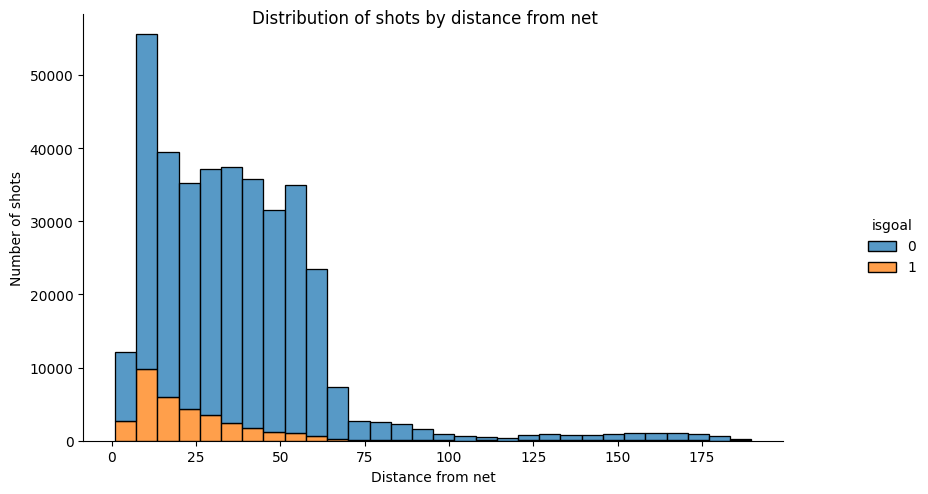
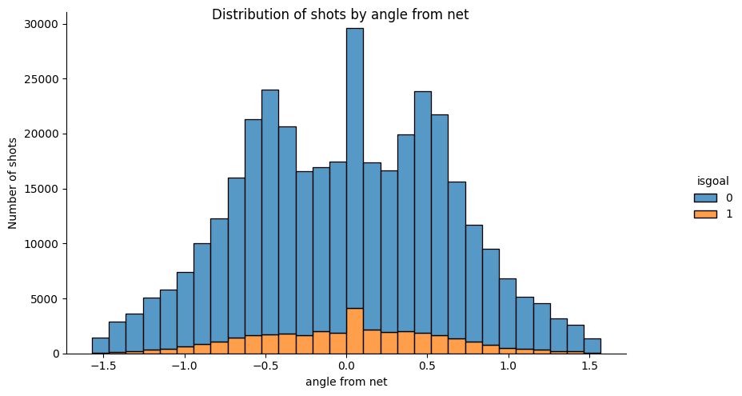
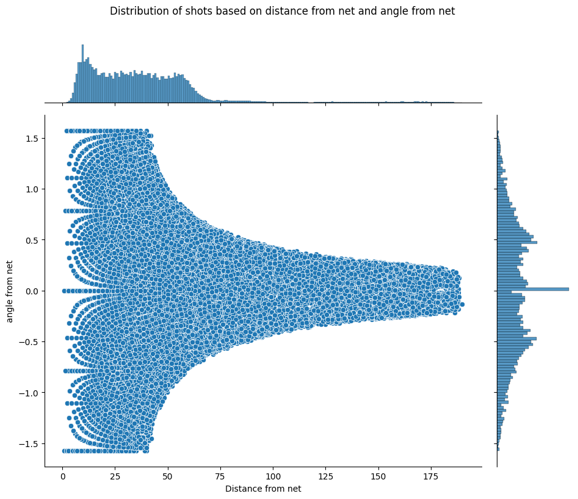
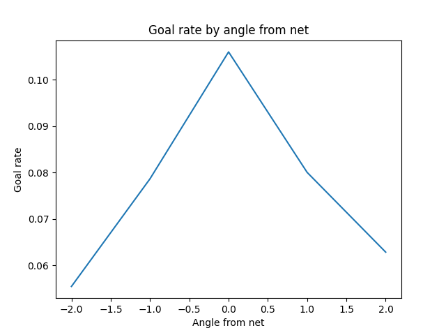
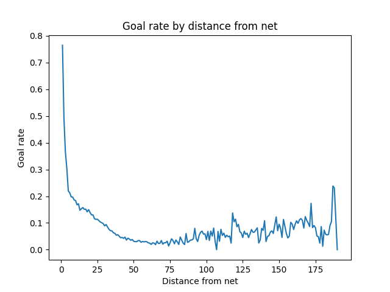
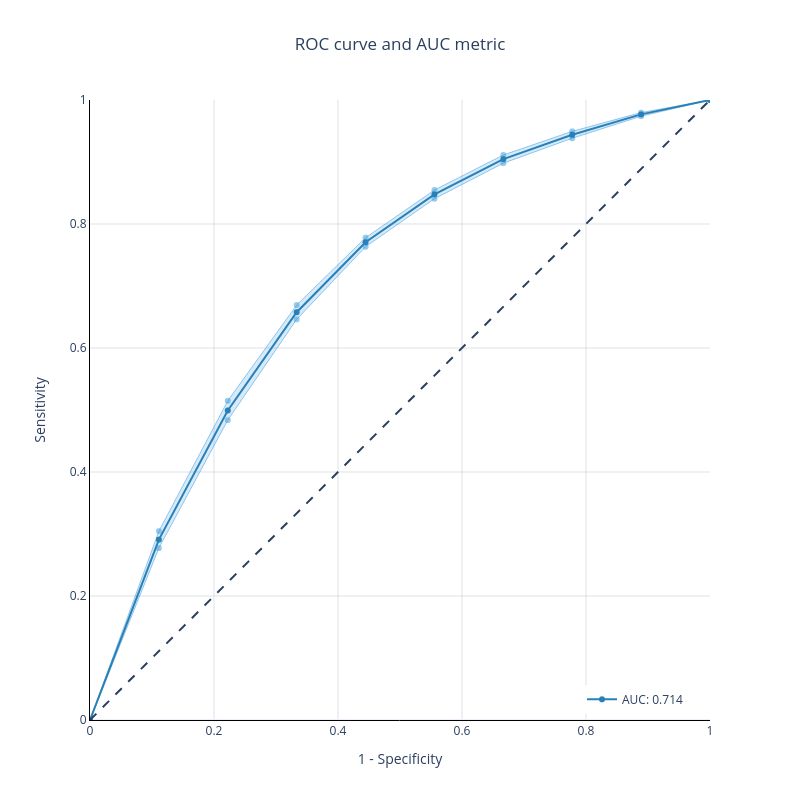
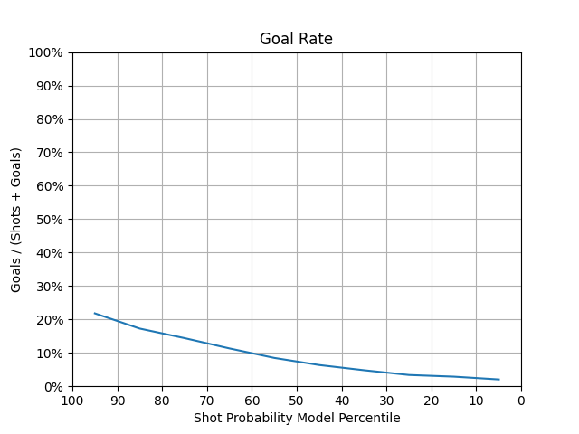
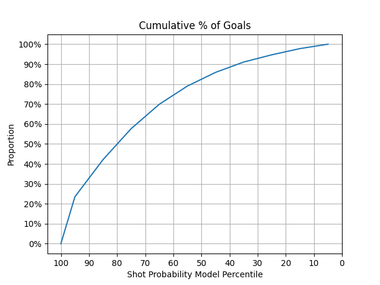
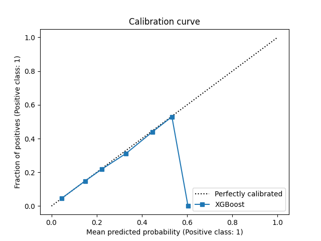

## feature engineering1 

This figure shows how the shot counts vary by distance from the net. As expected, the number of shots and goals decreases as the distance increases, since players tend to shoot closer to the net and scoring from far away is harder. In fact, there are no goals beyond 75 feet. Interestingly, the bin closest to the net does not have the highest number of shots or goals, which may be because it is more difficult to shoot past the goalie at a short range.

This figure shows how the shot counts and goals vary by the angle from the net. We can see that the probability of scoring a goal is higher when the angle is closer to zero, which means that the shooter is facing the net directly. However, the majority of the shots are taken from angles between -0.5 and 0.5 radians, which means that the shooters are slightly off-center. The goals do not follow this trend, and the highest number of goals is achieved at around 0 radian, which means that the shooters are more accurate when they are aligned with the net.

This figure shows how the angle from the net changes with the distance from the net for the shots and goals. We can see that the range of angles decreases as the distance increases, which means that the players shoot with smaller angles when they are farther from the net. This may be because shooting with larger angles from far away is less likely to score or hit the target. Moreover, the figure is symmetric, which means that the sign of the angle does not matter, and the players shoot equally from the left and right sides of the rink. However, the distribution of angles is different for the shots and goals near the net. The shots have a wider range of angles, and some of them are very large, which means that the players shoot from sharp angles close to the net. 

This figure shows how the probability of scoring a goal varies by the angle from the net. We can see that the probability is symmetric with respect to the sign of the angle, which means that it does not matter whether the shot is taken from the left or right side of the rink. However, the probability is higher when the angle is closer to zero, which means that shooting near the center of the rink or aligning with the net increases the chance of scoring a goal. The highest probability is achieved at around 0 radian, which corresponds to facing the net directly.

## Advanced Models
### 1.

To evaluate the model performance more reliably and robustly, I used repeated k-fold cross-validation with k=5 and 10 repetitions. This technique splits the data into five folds and trains and validates the model on different combinations of them. Then, it averages the results over the repetitions to reduce the variance of the estimate[1]. The following figures show the results of this section.

**Compare with logistic regression baseline**

[1]: For this section i have used the codes of this [website](https://towardsdatascience.com/pooled-roc-with-xgboost-and-plotly-553a8169680c#:~:text=To%20get%20a%20ROC%20curve,validation%20and%20got%20500%20results.)